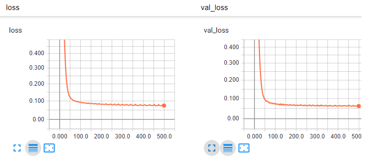

# Deep StringToString Translator

This is an translator captioning codebase in Tensorflow and Keras. The model is created based on LSTM.
You can use pretrained model or train the new model yourself. If you have any idea to enhance the accuracy of model or you have any idea to change the model,
it would be my pleasure to discuss about them. Feel free to share it by sending me an [email](saman.masarat@gmail.com).  

## Requirements
`requirements.txt` contains whole of dependencies which are needed to run and develop this repository. Just run `pip install -r requirements.txt` in your virtual environment. 

Directory `data/` contains sample dataset which can be used for training model. You can also use your own data. The only assumption should be considered is it should be tab separated.
 The first column is source language text and the second column is target language text. See `data/deu_eng.txt`.

## Pretrained models
Pretrained models are provided [here](https://www.dropbox.com/sh/2cc21gq9jq889bh/AACucPitQlN8IL0bLpEcqKOja?dl=0) for Dutch to English translation; and
[here](https://www.dropbox.com/sh/wnkxikx2l7vjdh3/AADDFfQznETdOhuTjvmSQzZqa?dl=0) for Persian to English. It is obvious that the accuracy can be developed by considering more input data.

## Quick overview with Jupyter NoteBook
This [Jupyter Notebook](./train_test_sequnce.ipynb) represents the whole process includes Loading data, 
tokenizing, encoding, normalizing, training, evaluation and testing step by step. You can review whole steps on this.

### Train your model
You can train this StringToString translator on any languages by running `train.py` script. Run `python train.py -h` to see options.
```
* --file_path: The path you have inserted your training data.
* --ignore_all_normalizations: If you are not sure about encodings normalization problems (i.e in Persian) pass it True.
    (in next versions, more customizable normalization will be provided).
* --num_training_records: Define number of records for trainin (consider your Ram and cpy/gpu supports)
* --save_source_tokenizer_path: Path you want save your source tokenizer. You need it for testing procedure. 
* --save_target_tokenizer_path: Path you want save your target tokenizer. You need it for testing procedure.
* --lstm_n_units: Number of LSTM units in training process. 
* --train_batch_size: Number of batch elements should be passed to 
* --save_model_path: Path to the direcotry you want save the model. You need it for testing procedure.
* --evaluation_percent: Percent of data you want use for evaluation.
* --num_epochs: Number of epochs for training process.
```
You can run train script with default values (after downloading required files and models and placing them in right places) by simply 
running `python train.py` . If you have installed `tensorboard` on your machine, you can check the
training procedure by accessing this `model/graph` file during training service. However here is all you need to run train
script and save your model.

```
python train.py --file_path=./data/deu_eng.txt --num_training_records=10000 --save_source_tokenizer_path=./model/ger_tokenizer.pkl --save_target_tokenizer_path=./model/eng_tokenizer.pkl --ls
tm_n_units=256 --train_batch_size=64 --save_model_path=./model/ger_eng_model.h5 --tensor_board_model_path=./model/graph --evaluation_percent=0.2 --num_epochs=10 --training_batch_size=64
```

### Test your model
You can test your trained StringToString translator by running `test.py` script. Run `python test.py -h` to see options.
```
* --model_path: Path to model.
* --test_sentences: Place the test sentences in "". i.e "es ist zu spat,du hast mir gefehlt" 
* --source_tokenizer: Path to soruce tokenizer pickle file.
* --target_tokenizer: Path to target tokenizer pickle file.
```
You can run test script with default values (after downloading required files and models and placing them in right places) by simply running `python test.py`
However here is all you need to run test script and get outputs.
```
python test.py --model_path=./model/ger_eng_model.h5 --test_sentences="ich bin brillentrager,du hast mir gefehlt" --source_tokenizer=./model/ger_tokenizer.pkl --target_tokenizer=./model/eng_tokenizer.pkl
```

## Sample outputs
Here are some outputs for German to English:
```
> ich bin brillentrager ==> i wear glasses
> du hast mir gefehlt ==> ive missed you
``` 
Or similarly for Persian to English:
```
> امروز صبح چکار کردی ==>  What did you do this morning
> امروز صبح ==> what your tomorrow
```
The point could be mentioned is by reviewing Persian to English model, we can conclude the model is not working perfectly. 
The Model returns perfect output for training data but its generalization is awful. The main reason is not enough training data.
It is completely obvious that a translator could not be trained with 1500 records! If you find better dataset or you trained more accurate models
ping me. I am always enthusiastic to discuss about them.  

## Tensorboard outputs
Here are tensorboard outputs. 




## Acknowledgements
There is no doubt that training this network with more data and more iteration will provied more accurate results.
In future versions we present novel networks with higher accuracy. So stay tuned with me!
Finally, I want to thank [Jason Brownlee](https://machinelearningmastery.com/develop-neural-machine-translation-system-keras/) article which inspired me to create and develop this repository.